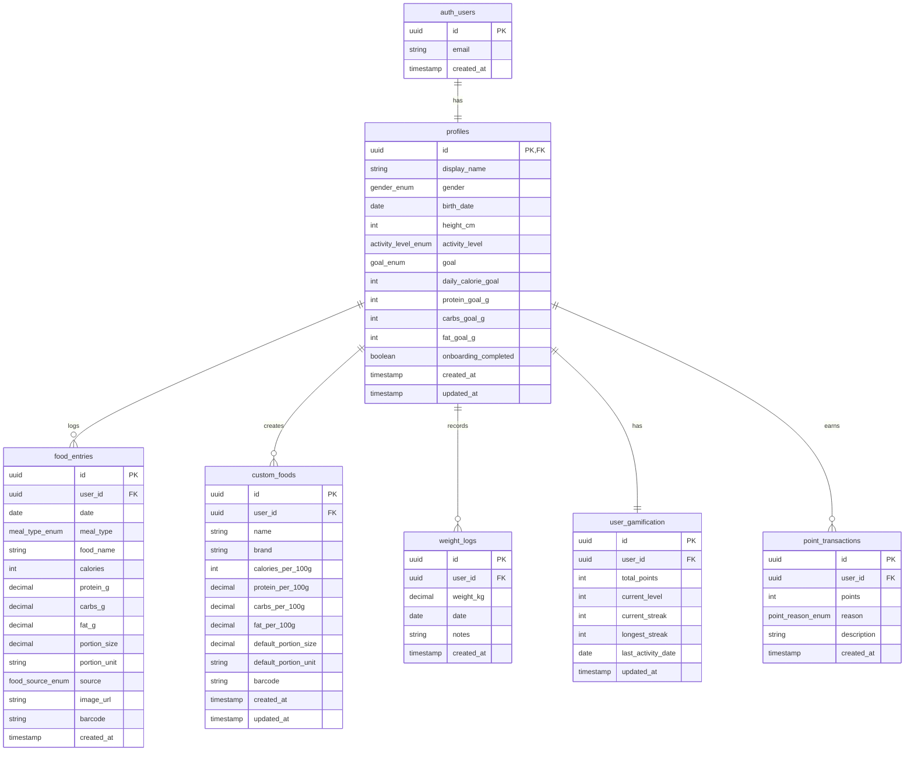
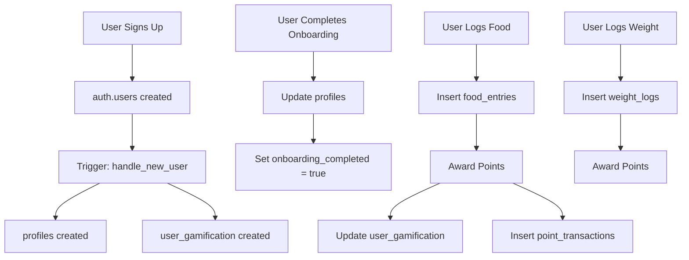

# MenuMate Database Schema

This document defines the complete database schema for MenuMate, implemented in Supabase (PostgreSQL).

## Entity Relationship Diagram (ERD)



## Enum Types

### gender_enum
| Value | Description |
|-------|-------------|
| `male` | Male |
| `female` | Female |
| `diverse` | Diverse / Non-binary |

### activity_level_enum
| Value | Name | Description | Factor |
|-------|------|-------------|--------|
| `sedentary` | Sedentary | Little or no exercise, desk job | 1.2 |
| `lightly_active` | Lightly Active | Light exercise 1-3 days/week | 1.375 |
| `moderately_active` | Moderately Active | Moderate exercise 3-5 days/week | 1.55 |
| `very_active` | Very Active | Intense exercise 6-7 days/week | 1.725 |
| `extremely_active` | Extremely Active | Very intense exercise, physical labor | 1.9 |

### goal_enum
| Value | Description | Calorie Adjustment |
|-------|-------------|-------------------|
| `lose` | Lose weight | TDEE - 500 kcal |
| `maintain` | Maintain weight | TDEE |
| `gain` | Build muscle / Gain weight | TDEE + 300 kcal |

### meal_type_enum
| Value | Display Name | Emoji |
|-------|--------------|-------|
| `breakfast` | Breakfast | 🍳 |
| `lunch` | Lunch | 🍝 |
| `dinner` | Dinner | 🍽️ |
| `snack` | Snacks | 🍎 |

### food_source_enum
| Value | Description |
|-------|-------------|
| `manual` | Manually entered by user |
| `openfoodfacts` | From OpenFoodFacts API |
| `ai_scan` | Recognized via AI (Gemini) |
| `custom` | From user's custom foods |

### point_reason_enum
| Value | Description | Points |
|-------|-------------|--------|
| `meal_logged` | User logged a meal | +5 |
| `goal_reached` | Daily calorie goal reached | +20 |
| `streak_bonus` | Streak milestone (7, 30, 100 days) | +50/+100/+500 |
| `weight_logged` | User logged weight | +10 |
| `decay` | Inactivity penalty | -5 per day |

## Table Definitions

### profiles

Primary user profile data, linked 1:1 with Supabase `auth.users`.

| Column | Type | Nullable | Default | Description |
|--------|------|----------|---------|-------------|
| `id` | `uuid` | NO | - | PK, FK → auth.users.id |
| `display_name` | `text` | YES | `NULL` | User's display name |
| `gender` | `gender_enum` | YES | `NULL` | Gender for BMR calculation |
| `birth_date` | `date` | YES | `NULL` | Birth date for age calculation |
| `height_cm` | `integer` | YES | `NULL` | Height in centimeters |
| `activity_level` | `activity_level_enum` | YES | `NULL` | Daily activity level |
| `goal` | `goal_enum` | YES | `NULL` | Weight goal |
| `daily_calorie_goal` | `integer` | YES | `NULL` | Calculated or custom calorie goal |
| `protein_goal_g` | `integer` | YES | `NULL` | Protein target in grams |
| `carbs_goal_g` | `integer` | YES | `NULL` | Carbohydrates target in grams |
| `fat_goal_g` | `integer` | YES | `NULL` | Fat target in grams |
| `onboarding_completed` | `boolean` | NO | `false` | Has user completed onboarding? |
| `created_at` | `timestamptz` | NO | `now()` | Record creation timestamp |
| `updated_at` | `timestamptz` | NO | `now()` | Last update timestamp |

**Indexes:**
- Primary Key: `id`

**RLS Policies:**
- SELECT: Users can only read their own profile
- INSERT: Users can only create their own profile
- UPDATE: Users can only update their own profile
- DELETE: Users can only delete their own profile

---

### food_entries

Daily food journal entries.

| Column | Type | Nullable | Default | Description |
|--------|------|----------|---------|-------------|
| `id` | `uuid` | NO | `gen_random_uuid()` | Primary key |
| `user_id` | `uuid` | NO | - | FK → profiles.id |
| `date` | `date` | NO | `CURRENT_DATE` | Entry date |
| `meal_type` | `meal_type_enum` | NO | - | Meal category |
| `food_name` | `text` | NO | - | Name of the food |
| `calories` | `integer` | NO | - | Total calories |
| `protein_g` | `numeric(6,2)` | YES | `NULL` | Protein in grams |
| `carbs_g` | `numeric(6,2)` | YES | `NULL` | Carbohydrates in grams |
| `fat_g` | `numeric(6,2)` | YES | `NULL` | Fat in grams |
| `portion_size` | `numeric(8,2)` | NO | `100` | Portion size |
| `portion_unit` | `text` | NO | `'g'` | Unit (g, ml, piece, portion) |
| `source` | `food_source_enum` | NO | `'manual'` | Data source |
| `image_url` | `text` | YES | `NULL` | URL to food image |
| `barcode` | `text` | YES | `NULL` | EAN/UPC barcode |
| `created_at` | `timestamptz` | NO | `now()` | Record creation timestamp |

**Indexes:**
- Primary Key: `id`
- Index: `user_id, date` (for daily queries)
- Index: `user_id, date, meal_type` (for meal grouping)

**RLS Policies:**
- SELECT: Users can only read their own entries
- INSERT: Users can only create entries for themselves
- UPDATE: Users can only update their own entries
- DELETE: Users can only delete their own entries

---

### custom_foods

User-created custom food items for reuse.

| Column | Type | Nullable | Default | Description |
|--------|------|----------|---------|-------------|
| `id` | `uuid` | NO | `gen_random_uuid()` | Primary key |
| `user_id` | `uuid` | NO | - | FK → profiles.id |
| `name` | `text` | NO | - | Food name |
| `brand` | `text` | YES | `NULL` | Brand name |
| `calories_per_100g` | `integer` | NO | - | Calories per 100g/ml |
| `protein_per_100g` | `numeric(6,2)` | YES | `NULL` | Protein per 100g/ml |
| `carbs_per_100g` | `numeric(6,2)` | YES | `NULL` | Carbs per 100g/ml |
| `fat_per_100g` | `numeric(6,2)` | YES | `NULL` | Fat per 100g/ml |
| `default_portion_size` | `numeric(8,2)` | YES | `100` | Default portion size |
| `default_portion_unit` | `text` | YES | `'g'` | Default unit |
| `barcode` | `text` | YES | `NULL` | Optional barcode |
| `created_at` | `timestamptz` | NO | `now()` | Record creation timestamp |
| `updated_at` | `timestamptz` | NO | `now()` | Last update timestamp |

**Indexes:**
- Primary Key: `id`
- Index: `user_id` (for user's food list)
- Index: `user_id, name` (for search)
- Unique: `user_id, barcode` WHERE barcode IS NOT NULL

**RLS Policies:**
- SELECT: Users can only read their own custom foods
- INSERT: Users can only create custom foods for themselves
- UPDATE: Users can only update their own custom foods
- DELETE: Users can only delete their own custom foods

---

### weight_logs

Weight tracking history.

| Column | Type | Nullable | Default | Description |
|--------|------|----------|---------|-------------|
| `id` | `uuid` | NO | `gen_random_uuid()` | Primary key |
| `user_id` | `uuid` | NO | - | FK → profiles.id |
| `weight_kg` | `numeric(5,2)` | NO | - | Weight in kilograms |
| `date` | `date` | NO | `CURRENT_DATE` | Measurement date |
| `notes` | `text` | YES | `NULL` | Optional notes |
| `created_at` | `timestamptz` | NO | `now()` | Record creation timestamp |

**Indexes:**
- Primary Key: `id`
- Index: `user_id, date DESC` (for history queries)
- Unique: `user_id, date` (one entry per day)

**RLS Policies:**
- SELECT: Users can only read their own weight logs
- INSERT: Users can only create weight logs for themselves
- UPDATE: Users can only update their own weight logs
- DELETE: Users can only delete their own weight logs

---

### user_gamification

Gamification stats per user.

| Column | Type | Nullable | Default | Description |
|--------|------|----------|---------|-------------|
| `id` | `uuid` | NO | `gen_random_uuid()` | Primary key |
| `user_id` | `uuid` | NO | - | FK → profiles.id (UNIQUE) |
| `total_points` | `integer` | NO | `0` | Total accumulated points |
| `current_level` | `integer` | NO | `1` | Current level |
| `current_streak` | `integer` | NO | `0` | Current consecutive days |
| `longest_streak` | `integer` | NO | `0` | Longest streak ever |
| `last_activity_date` | `date` | YES | `NULL` | Last day with logged activity |
| `updated_at` | `timestamptz` | NO | `now()` | Last update timestamp |

**Indexes:**
- Primary Key: `id`
- Unique: `user_id` (1:1 with profiles)

**RLS Policies:**
- SELECT: Users can only read their own gamification data
- INSERT: Users can only create gamification data for themselves
- UPDATE: Users can only update their own gamification data

---

### point_transactions

Audit log of all point changes.

| Column | Type | Nullable | Default | Description |
|--------|------|----------|---------|-------------|
| `id` | `uuid` | NO | `gen_random_uuid()` | Primary key |
| `user_id` | `uuid` | NO | - | FK → profiles.id |
| `points` | `integer` | NO | - | Points gained/lost (can be negative) |
| `reason` | `point_reason_enum` | NO | - | Reason for point change |
| `description` | `text` | YES | `NULL` | Optional description |
| `created_at` | `timestamptz` | NO | `now()` | Transaction timestamp |

**Indexes:**
- Primary Key: `id`
- Index: `user_id, created_at DESC` (for history)

**RLS Policies:**
- SELECT: Users can only read their own transactions
- INSERT: System only (via triggers/functions)

---

## Database Functions

### update_updated_at_column()

Trigger function to automatically update the `updated_at` timestamp.

```sql
CREATE OR REPLACE FUNCTION update_updated_at_column()
RETURNS TRIGGER AS $$
BEGIN
    NEW.updated_at = NOW();
    RETURN NEW;
END;
$$ LANGUAGE plpgsql;
```

### handle_new_user()

Trigger function to create profile and gamification records when a new user signs up.

```sql
CREATE OR REPLACE FUNCTION handle_new_user()
RETURNS TRIGGER AS $$
BEGIN
    -- Create profile
    INSERT INTO public.profiles (id)
    VALUES (NEW.id);
    
    -- Create gamification record
    INSERT INTO public.user_gamification (user_id)
    VALUES (NEW.id);
    
    RETURN NEW;
END;
$$ LANGUAGE plpgsql SECURITY DEFINER;
```

### calculate_daily_stats()

Function to calculate daily totals for a user.

```sql
CREATE OR REPLACE FUNCTION calculate_daily_stats(p_user_id uuid, p_date date)
RETURNS TABLE (
    total_calories integer,
    total_protein numeric,
    total_carbs numeric,
    total_fat numeric,
    entry_count integer
) AS $$
BEGIN
    RETURN QUERY
    SELECT
        COALESCE(SUM(calories), 0)::integer,
        COALESCE(SUM(protein_g), 0),
        COALESCE(SUM(carbs_g), 0),
        COALESCE(SUM(fat_g), 0),
        COUNT(*)::integer
    FROM food_entries
    WHERE user_id = p_user_id AND date = p_date;
END;
$$ LANGUAGE plpgsql SECURITY DEFINER;
```

---

## Level System

| Level | Points Required | Title |
|-------|-----------------|-------|
| 1 | 0 | Beginner |
| 2 | 100 | Newcomer |
| 3 | 300 | Regular |
| 4 | 600 | Dedicated |
| 5 | 1000 | Committed |
| 6 | 1500 | Expert |
| 7 | 2500 | Master |
| 8 | 4000 | Champion |
| 9 | 6000 | Legend |
| 10 | 10000 | MenuMate Pro |

---

## Data Flow



---

## Security Considerations

1. **Row Level Security (RLS)**: All tables have RLS enabled with policies that ensure users can only access their own data.

2. **Foreign Keys**: All user-related tables reference `profiles.id`, which in turn references `auth.users.id`.

3. **Cascading Deletes**: When a user is deleted from `auth.users`, all related data is cascaded deleted.

4. **Input Validation**: Application-level validation before database operations.

5. **Timestamps**: All tables include `created_at` for audit purposes.

---

## Migration Order

1. Create enum types
2. Create `profiles` table with trigger from `auth.users`
3. Create `user_gamification` table
4. Create `food_entries` table
5. Create `custom_foods` table
6. Create `weight_logs` table
7. Create `point_transactions` table
8. Create database functions
9. Set up RLS policies
10. Create indexes
